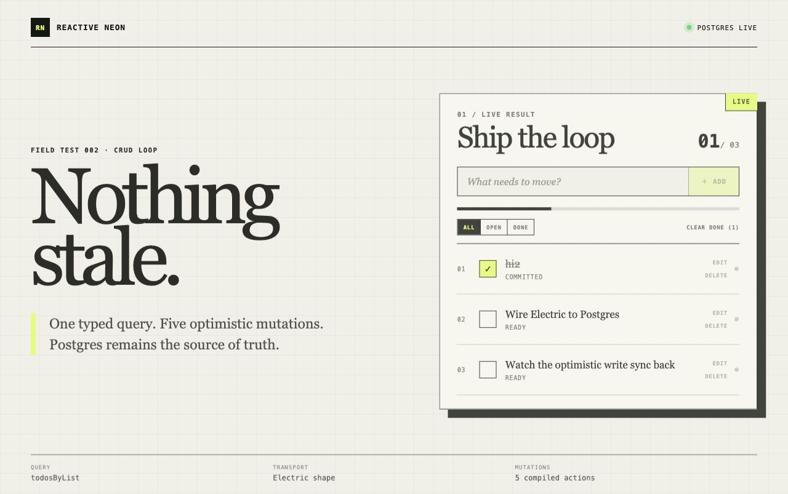

# still-life

A prototype for reactive query/mutation system around postgres.

You write named queries and mutations. A compiler turns them into authorized
Node routes, typed TanStack DB query sources, and optimistic client actions.

This repository is an executable sketch of the API and runtime design.

The demo uses Electric to carry changes from Postgres to the browser.



## DX sketch

Application code lives in one directory. A query is a normal Node handler that
returns an unexecuted Drizzle builder:

```ts
export const todosByList = defineQuery({
  input: z.object({ listId: z.string() }),
  query: (req: AppRequest, res, { listId }) =>
    req.context.db
      .select({
        id: todos.id,
        listId: todos.listId,
        text: todos.text,
        completed: todos.completed,
        updatedAt: todos.updatedAt,
      })
      .from(todos)
      .where(and(
        eq(todos.listId, listId),
        eq(todos.ownerId, req.context.userId),
      )),
})
```

The handler receives the real `req` and `res`, so auth and branching stay in
normal server code. The return value is still just a Drizzle query.

A mutation puts its client prediction beside its authoritative Postgres write:

```ts
export const setTodoCompleted = defineMutation({
  input: z.object({
    id: z.string(),
    listId: z.string(),
    completed: z.boolean(),
  }),

  optimistic: (queries, { id, listId, completed }) => {
    queries.todosByList({ listId }).update(id, draft => {
      draft.completed = completed
    })
  },

  mutation: async (req: AppRequest, res, args) => {
    const [todo] = await req.context.db
      .update(todos)
      .set({
        completed: args.completed,
        updatedAt: new Date().toISOString(),
      })
      .where(and(
        eq(todos.id, args.id),
        eq(todos.listId, args.listId),
        eq(todos.ownerId, req.context.userId),
      ))
      .returning()

    if (!todo) throw new Error("Todo not found")
    return todo
  },
})
```

`queries` is the set of exact query instances already loaded in this client.
Optimism can update those results, but it cannot silently load or mutate some
generic table cache. If `todosByList({ listId })` is not loaded, the action
throws `QueryNotLoadedError` before making an HTTP request.

Run the compiler:

```sh
pnpm generate
```

It emits two targets:

```text
src/app/procedures.ts
        │
        ├── src/generated/routes.ts          server query/mutation routes
        └── src/generated/neon-realtime.ts   TanStack DB client bindings
```

The React call site is intentionally small:

```tsx
import { useLiveQuery } from "@tanstack/react-db"
import {
  setTodoCompleted,
  todosByList,
} from "./generated/neon-realtime.js"

const { data: todos } = useLiveQuery(
  todosByList({ listId }),
  [listId],
)

setTodoCompleted({
  id: todo.id,
  listId,
  completed: true,
})
```

No handwritten fetcher, cache key, invalidation rule, WebSocket event, or
client response type is required.

## Design target

The key constraint is on the system, not the developer: application authors
should keep writing normal Drizzle queries.

- A query may contain ordinary request handling, auth, and control flow. An
  admin branch and a user branch may return different SQL builders under one
  named query.
- The compiler inspects the builder that a branch actually returns. Developers
  do not annotate tables, predicates, joins, or cache dependencies a second
  time.
- The generated client target is a TanStack DB source query. The mechanism that
  keeps that source current is replaceable: a change stream, query
  re-execution, a hosted service, or another sync adapter can sit behind the
  same application API.
- Every returned SQL structure becomes a versioned plan variant under the same
  query contract. Clients can track query availability and version across
  deployments.
- The Drizzle result type is the client result type. The design does not pay to
  validate every result row again at runtime; the backend owns that guarantee.
- Mutation conflicts remain normal application logic inside the authoritative
  mutator. TanStack DB owns optimistic state, mutation IDs, offline replay, and
  rollback. The source adapter decides how authoritative writes reconcile with
  that optimistic state.

The desired abstraction is therefore a directory of named application
operations, not a new query language or a client-owned replica schema.

## How the design works

For each named query, the compiler and runtime:

1. validate the arguments;
2. run the query function with the real authenticated request;
3. call Drizzle's `.toSQL()` on the returned builder;
4. record the SQL structure, parameters, result shape, and a versioned plan
   variant;
5. generate the server operation and its typed client query source;
6. hand that source to the configured live-query adapter.

Auth branches may return different builders. Each normalized SQL structure
gets a `planVariantHash` under the same named query contract.

Different adapters may need different SQL analysis and execution plans. A
change-stream adapter might derive tables and predicates. A query-reexecution
adapter might only need a stable query identity and invalidation inputs. That
choice should not change the handwritten operation or the React call site.

For a mutation, the server opens a Postgres transaction and swaps
`req.context.db` for its transaction handle while the handwritten mutator runs.
It reads the transaction ID before commit and returns it with the result.

The generated TanStack action applies the optimistic body at once. It keeps
that optimistic layer until the configured source adapter confirms the
authoritative write. A backend failure rolls the whole layer back.

```text
click
  → optimistic query update
  → POST generated mutator route
  → authoritative Postgres transaction
  → source adapter confirms the write
  → optimistic state is replaced by authoritative state
```

## The prototype app

The React app exercises one live query and five compiled mutations:

- create a todo;
- edit its text;
- toggle completion;
- delete one todo;
- clear a set of completed todos.

It also has local all/open/done filters. Those are ordinary TanStack live-query
projections over the server-owned source query.

## Run it locally

Requirements: Node.js, pnpm, and Docker.

Install packages and start Postgres plus Electric:

```sh
pnpm install
pnpm stack:up
pnpm db:setup
```

Start the generated Node API:

```sh
pnpm server
```

In a second terminal, start Vite:

```sh
pnpm dev
```

Open [http://127.0.0.1:5173](http://127.0.0.1:5173).

Local ports:

| Service | Port |
| --- | ---: |
| Vite | `5173` |
| Node API | `4000` |
| Electric | `3000` |
| Postgres | `54321` |

The demo accepts `x-user-id` and falls back to `user-1`. That is a visible
stand-in for session verification, not production authentication.

## Verify the whole path

Unit tests cover the compiler, SQL planner, server runtime, optimistic updates,
unloaded-query failures, and rollback:

```sh
pnpm test
```

The integration test for this particular adapter runs real Postgres → Electric
→ TanStack DB create, update, toggle, and delete cycles. At each stage it
compares the live result with a fresh execution of the original Drizzle
builder:

```sh
pnpm test:e2e
```

Type-check the Node code and build the React client:

```sh
pnpm build
```

Stop the local services without deleting Postgres data:

```sh
pnpm stack:down
```

## What this prototype implements

To keep the executable demo small, this repository implements one planner
strategy: **Direct Shape**. It accepts one-table projections of direct columns
with a selected primary key and a Shape-compatible predicate.

That planner compiles the SQL into an authorized Electric Shape and uses the
Postgres transaction ID to reconcile optimistic state. Both choices belong to
the demo adapter and can be replaced.

The prototype fails closed on SQL that needs a different strategy. Joins,
computed projections, ordering, limits, grouping, and set operations raise
`UnsupportedLiveQueryError` because the demo has not built its projection and
server-recompute planners yet. Those are implementation gaps in this repo, not
API restrictions in the design.

The demo's query functions are synchronous because an async function would
currently assimilate and execute Drizzle's thenable builder before this
planner can inspect it. A full implementation can put an explicit planning
wrapper around async request work without changing the client API.

## Repository map

| Path | Role |
| --- | --- |
| `src/app/procedures.ts` | Handwritten query and mutation API |
| `src/app/schema.ts` | Drizzle schema |
| `src/compiler/query-planner.ts` | PostgreSQL AST to Direct Shape planner |
| `src/compiler/drizzle-adapter.ts` | Drizzle selected-field adapter |
| `src/runtime/server.ts` | Node routes, transactions, and Electric proxy |
| `src/runtime/client.ts` | Query registry and optimistic action runtime |
| `src/generated/` | Compiled server and browser bindings |
| `src/client/` | Vite/React example |
| `scripts/generate.ts` | Fail-closed compiler |
| `scripts/e2e.ts` | Real sync-back verification |
| `docker-compose.yml` | Local Postgres and Electric services |

## Neon

Set `DATABASE_URL` to a direct, unpooled Neon connection with logical
replication enabled. Point `ELECTRIC_URL` at an Electric service connected to
that database. The local defaults are in `.env.example`.
